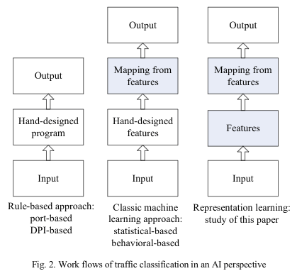
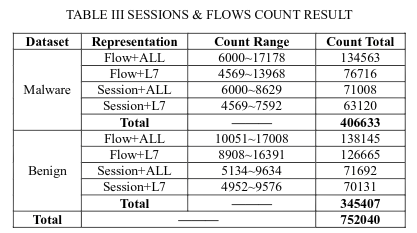
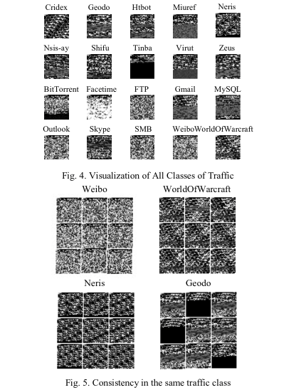
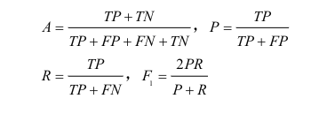
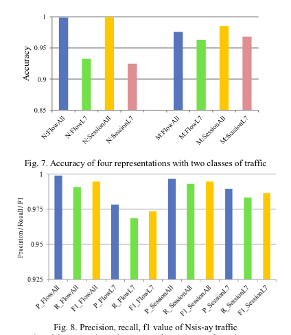

# 基于卷积神经网络的表示学习恶意软件流量分类

## 摘要

流量分类是网络异常检测或基于网络的入侵检测系统的第一步，在网络安全领域发挥着重要作用。 在本文中，我们首先从人工智能的角度提出了一种新的流量分类分类，然后提出了一种以流量数据为图像的卷积神经网络恶意软件流量分类方法。 该方法不需要人工设计的功能，但直接将原始流量作为分类器的输入数据。 据我们所知，这一有趣的尝试是第一次将表示学习方法应用于使用原始流量数据的恶意软件流量分类。 我们确定最佳类型的流量表示是通过八个实验与所有层进行会话。 该方法在包括三种分类器的两种情况下得到验证，实验结果表明，该方法能够满足实际应用的精度要求。

关键词:流量分类; 卷积神经网络; 表征学习; 网络异常检测; 入侵侦测系统

## 引言

流量分类是将网络流量与生成应用程序相关联的任务，这在网络管理尤其是网络安全域中是一项至关重要的任务。 在网络安全域中，流量分类实际上代表了异常检测等识别恶意使用网络资源的活动的第一步[1]。

有四种主要的流量分类方法[1]：基于端口，基于深度包检测（DPI），基于统计和基于行为。 从人工智能（AI）开发[2]的角度来看，基于端口和基于DPI的方法是基于规则的方法，它们通过匹配预定义的硬编码规则来执行流量分类。 基于统计和基于行为的方法是经典的机器学习方法，其通过使用一组选择性特征从经验数据中提取模式来对流量进行分类。 虽然经典的机器学习方法解决了基于规则的方法无法解决的许多问题，例如加密的流量分类和高计算成本，但它面临着设计适当特征的新挑战，并且许多最近的研究都集中在这个问题上[3]。

表示学习是近年来一种新兴的快速发展的机器学习方法，它从原始数据中自动学习特征，并在一定程度上解决了手工设计特征的问题[4]。 特别是深度学习方法是一种典型的表征学习方法，在包括图像分类和语音识别在内的许多领域都取得了很好的表现[5] [6]。 本文的主要目的是尝试将表示学习方法应用于恶意软件流量分类领域并证明其有效性。 图1说明了AI视角下的流量分类分类。 图2显示了这些方法的不同工作流程，阴影框表示能够从数据中学习的组件[2]

本文使用的技术是卷积神经网络（CNN），它是目前最流行的表示学习方法之一。我们并不从数据流量中提取特征将而是将原始流量数据作为图像，然后使用CNN进行图像分类，这是CNN最常见的任务[7]，最终实现了恶意软件流量分类的目标。 据我们所知，这一有趣的尝试是使用原始流量数据首次将表示学习方法应用于恶意软件流量分类域。 由于交通数据的连续性和图像数据的离散性之间的差异，研究了多种交通代表类型，并通过实验找到了最佳类型。 为了证明我们提出的方法的可扩展性，我们使用三种类型的分类器在两种情况下进行实验，最终平均准确度为99.41％，符合实际应用标准。 此外，还创建了一个交通数据集USTC-TFC2016，并开发了一个数据预处理工具包USTC-TK2016。 我们的工作中的这两个以及我们的培训和测试源代码都将在GitHub上发布给感兴趣的研究人员。

本文的其余部分安排如下。 第二节描述了相关工作并介绍了我们工作的动力。 第III节描述了使用CNN的方法。 第四节介绍了实验结果和分析。 第五节描述了我们当前方法和未来工作的局限性。 第六节提供结论性意见。

## 相关工作

基于规则的流量分类方法在业界相对成熟，相关工作主要集中在如何准确提取映射规则和提高性能。 Finsterbusch等。 [8]总结了目前主要的基于DPI的流量分类方法。 流量分类的经典机器学习方法在学术界吸引了大量的研究，相关工作主要集中在如何选择更好的特征集。 Dhote等人。 [3]提供了一个关于互联网流量分类特征选择技术的调查。

现在有一些关于基于表示学习的流量分类的研究。Gao等人, [9]提出了一种使用深度信念网络的恶意软件流量分类方法。 Javaid等, [10]提出了一种使用稀疏自动编码器的恶意软件流量识别方法。 这些研究均采用深度学习技术，应用于基于网络的入侵检测系统（NIDS）的设计。 但他们的研究中存在同样的问题，他们都使用手工设计的流动特征数据集作为输入数据（分别为KDD CUP1999和NSL-KDD [11]）。 表示学习的最大优点是能够直接从原始数据中学习特征，深度学习在图像分类领域和语音识别领域的成功应用已经充分证明了这一点。 不幸的是，上述两项研究刚刚放弃了这一优势。 Wang [12]提出了一种基于堆叠自动编码器（SAE）的网络协议识别方法，利用原始流量数据，实现了高精度。 流量分类和协议识别是非常相似的任务。 因此，有理由认为表示学习方法可以在恶意软件流量分类任务中实现良好的性能。

在本文中，我们通过这些研究来推动使用原始流量数据执行恶意软件流量分类任务，并且我们使用的表示方法是CNN，其在​​图像分类任务中优于SAE。

## 研究方法

### 数据集

正如Dainotti等人 [13]指出，缺乏各种可共享的跟踪数据集作为测试数据是进行流量分类最明显的障碍。 大量关于恶意软件流量分类的研究使用了自我收集的流量或安全公司的私人流量，从而损害了其结果的可信度。 因为经典机器学习方法关注于特征选择技术，所以许多当前公共交通数据集是除了原始流量数据集之外的流特征数据集，例如， 着名的KDD CUP1999和NSL-KDD在其数据集[11]中提供了预定义的41个特征，并且有许多类似的数据集，如[14]。 这些数据集不符合我们对原始流量的要求。 在提供原始流量的数据集中，很少有包含正常和恶意软件流量数据的数据，例如[15]。

为了解决这些问题，创建了数据集USTC-TFC2016。 数据集由两部分组成，如表I和表II所示。 第一部分包含10种类型的公共网站恶意软件流量，这些流量是由CTU研究员从2011年到2015年从真实网络环境中收集的[16]。 对于一些尺寸太大的流量，只使用了其中一部分。 对于一些尺寸太小的流量，我们合并它们是由同一个应用程序生成的。 第二部分包含使用IXIA BPS [17]收集的十种正常流量，这是一种专业的网络流量模拟设备。 有关模拟方法详细信息，请访问其产品网站。 为了尽可能多地反映流量，十种流量包含八类常见应用。 USTC-TFC2016数据集的大小为3.71GB，格式为pcap。 它将在感兴趣的研究人员的GitHub上发布。

.png)

### 网络流量表示

基于机器学习的流量分类方法需要首先根据特定的粒度将连续流量分割为离散单元。 另一方面，可以在每个分组中选择不同的OSI或TCP / IP层。 以下部分介绍了如何在我们的方法中选择流量粒度和数据包层。

#### 流量粒度

网络流量分割粒度包括：TCP连接，流量，会话，服务和主机[13]。 不同的分割粒度导致不同的流量单位。 我们的方法使用流量和会话，大多数研究人员也使用它。 流被定义为具有相同5元组的所有分组，即源IP，源端口，目的地IP，目的地端口和传输级协议。 会话被定义为双向流，包括两个流量方向。 形式描述描述如下：

- 原始流量
- 流
- 会话

不同的流或会话可以具有不同的大小，但CNN的输入数据大小必须是统一的，因此仅使用每个流或会话的前n个字节（在本文中n = 784）。 我们可以直观地解释这个选择。 通常，流或会话的前部通常是连接数据和一些内容数据，并且应该最好地反映流或会话的固有特征。 这种选择与[18,19]非常相似，它使用经典机器学习方法研究恶意软件流量识别。 此外，因为只使用了前几百个字节，所以此方法比许多基于规则的方法更轻量级。

### 包层

从分组层分析的角度来看，直观地，内在特征应该反映在TCP / IP模型的应用层中，即OSI模型的第7层。 例如，STMP协议表示电子邮件流量，HTTP协议表示浏览器流量。 基于这种假设，Wa ng [12]仅选择第7层，并将其称为TCP会话有效载荷。 另一方面，其他层的数据也应包含一些流量特征信息。 例如，传输层中的端口信息可以使用标准端口号识别大多数应用程序。 有时标志信息可以识别网络攻击，例如 SYN攻击和RST攻击。 因此，使用了两种类型的包层选择：所有层（全部）和仅第7层（L7）。 应注意，会话或流中的IP和MAC信息可能损坏特征提取过程。 为消除这种负面影响，我们必须通过随机化删除该信息，通常称为流量匿名化或清除[20]。

总之，有四种类型的流量表示：Flow + All，Flow + L7，Session + All，Session + L7。 他们的表现使用A部分介绍的两种交通数据进行了测试，最后确定了最佳表现形式。 因此，本研究共有8个实验，结果和分析见第一节。

### 数据预处理

数据预处理是将原始流量数据（pcap格式）转换为CNN输入数据（idx格式）的过程。 它包括四个步骤：流量分割，流量清除，图像生成和IDX转换，并相应地开发了工具包USTC-TL2016。 图3显示了数据预处理的整个过程。

第1步（流量分割）。 此步骤将连续的原始流量分成多个离散流量单位。 输入数据格式为pcap。 如果表示类型是Flow + All或Session + All，则输出数据格式为pcap。 如果表示类型是Flow + L7或Session + L7，则输出数据格式为bin

第2步（流量清除）。 该步骤首先执行流量匿名/清理，其分别在数据链路层和IP层中随机化MAC地址和IP地址。 这是可选的，例如，当所有流量来自同一网络时，MAC和IP可能不再是区分信息，在这种情况下我们不需要执行它。 清除流量的第二个动作是文件清理。 某些数据包没有应用程序层，因此结果bin文件为空。 一些数据包在具有相同内容时生成相同的文件，并且重复数据在训练CNN时可能导致偏差。 需要删除那些空的和重复的文件。 此步骤中的数据格式没有变化。

第3步（图像生成）。 此步骤首先将所有文件修剪为统一长度。 如果文件大小大于784字节，则将其修剪为784字节。 如果文件大小小于784字节，则最后添加0x00以将其补充为784字节。 然后将具有相同大小的结果文件转换为灰色图像。 原始文件的每个字节代表一个像素，例如， 0x00为黑色，0xff为白色。 实际上，这种转换是可选的，我们可以直接将文件转换为IDX文件。 这种转换只是为了向研究人员展示视觉图像，因此可以通过视觉方式对其进行分析。

第4步（IDX转换）。 此步骤将图像转换为IDX格式文件。 IDX文件包含一组图像的所有像素和统计信息。 IDX格式是机器学习领域中常见的文件格式[21]。

USTC-TFC2016流量数据集使用USTC-TK2016工具包进行处理，共生成752,040条记录。 表III显示了结果。 由于会话包括双向流，因此会话数通常少于流。

### 可视化分析

在此部分中分析了在数据预处理过程的步骤3之后生成的图像。 每个灰度图像的大小为784（28 * 28）字节。 Session + All的可视化结果如图4和图5所示。其他三种表示形式的结果与它们大致相似。

图4显示了所有类的可视化结果。 很明显，它们很容易相互区分。 只有少数图像非常相似，例如 FTP和SMB。 图5显示了相同流量类的一致性。 显示了一个类中的九个随机选择的图像和四个随机选择的类。 很明显，Weibo，WOW和Neris中的图像纹理非常相似。 只有Geodo图像可以分为两个子类，但即使各个子类中的图像纹理仍然非常相似。 其他16个类通常具有相似的一致性。

通过可视化分析，我们得出结论：不同类别的流量具有明显的识别度，每类流量具有较高的一致性，因此推测我们的方法可以取得良好的性能是合理的。

### CNN架构

预处理数据集的大小和每个图像的大小都与传统的MNIST数据集非常相似[21]，因此使用类似于LeNet-5 [22]的CNN架构，但在每个卷积层中有更多的通道。

CNN首先从IDX文件中读取大小为28 * 28 * 1的流量图像。 那些图像像素从[0,255]归一化为[0,1]。 第一卷积层C1用大小为5×5的32个内核执行卷积运算。 C1层的结果是32个大小为28 * 28的特征图。 P1层跟随C1层有2 * 2最大池化操作，结果是32个大小为14 * 14的特征图。 第二卷积层C2的内核大小也是5 * 5，但是具有64个信道。 结果是64个大小为14 * 14的特征图。 在第二个2 * 2最大合并层P2之后，生成大小为7 * 7的64个特征图。 最后两层是完全连接，结果大小分别为1024和10。 softmax函数用于输出每个类的概率。 此外，辍学用于缓解过度拟合。 CNN架构用于F部分中引入的所有三种类型的分类器。

### 可扩展性研究

包括三种类型的CNN分类器在内的两种应用场景用于验证所提方法的可扩展性：二元分类器，10级分类器，20级分类器。 图6显示了两种方案的实验设置。 我们使用了B部分确定的最佳流量表示类型。

场景A（二进制和10级分类器）。 在流量分类的实际应用中，最常见的要求只是恶意软件流量识别，这也是NIDS的主要目标。 如有必要，可以执行更精细的流量分类，以识别每类恶意软件和正常流量。 在这种情况下，首先执行二进制分类以识别恶意软件或正常，然后分别执行两个10级分类以识别每类流量。

场景B（10级和20级分类器）。 在某些应用中，我们需要一次对所有类型的流量进行分类，这要求分类器具有相对较高的性能。 进行了使用所有类别流量的20级分类。

## 评估

### 参数设置

TensorFlow [23]用作在Ubuntu 14.04 64位操作系统上运行的实验软件框架。 服务器是DELL R720，具有16核CPU和16GB内存。 AnNvidia Tesla K40m GPU用作加速器。 随机选择十分之一的数据作为测试数据，其余的是训练数据。 小批量大小为50，成本函数为交叉熵。 TensorFlow内置的梯度下降优化器用作优化器。 学习率为0.001，训练时间约为40个时期。

### 评测指标

使用了四种评估指标：准确度（A），精确度（P），召回率（R），f1值（F1）。 准确度用于评估分类器的整体性能。 精确度，召回率和f1值用于评估每类流量的性能。

其中TP是正确分类为X的实例数，TN是正确分类为Not-X的实例数，FP是错误分类为X的实例数，而FN是错误分类为Not-X的实例数。

### 实验结果与分析

进行了八次实验以确定最佳流量代表类型。 图7显示了恶意软件和普通流量数据集上四种表示类型的准确性。 从四个比较中可以发现，所有层的交通等级的准确性总是高于仅有L7层的交通等级。 除了正常流量中L7的会话和流量的准确度大致相等外，其他三个比较都表明使用会话的流量类的准确性总是高于使用流量。 图8显示了Nsis-ay的精度，recalland f1值，它是20类交通中的一种。 我们可以看到图7所示的相同模式。 在所有12个比较中，除了使用所有层的会话召回比使用所有层的流程略低（0.24％）之外，其他11个比较显示以下模式：具有所有层的流量类的精度，召回，f1值全部 高于仅L7层，使用会话的流量类的精度，召回率，f1值均高于使用流量。 不仅如此，在其他19类交通结果中也可以找到相同的模式。 总之，All优于L7，Session优于Flow。

可以对该模式给出直观的解释。 因为会话包含双向流，所以包含比单向流更多的交互信息。 由于所有层表示包含的层数多于L7层，尤其包括端口和标记信息，因此它可以表示更多的关键信息，这证明了我们在第III节B部分中的假设。 应该注意的是，许多类流量的L7层预处理结果记录比所有层预处理结果记录少得多，例如， CTU 107-1流量的L7层记录仅为8，但所有层记录均为16386.当生成相同数量的训练数据时，使用L7需要比所有层表示更多的流量数据。 因此我们可以看到所有图层表示比L7图层表示更灵活。

总之，可以发现最佳类型的流量表示是Session + All。 仅使用该类型的流量表示来执行可伸缩性实验。

### 可扩展性实验结果与分析

表IV显示了使用Session + All流量表示的两种情况下三种类型分类器的总体准确性。 表V和VI显示了每类流量的精度，召回率和f1值。 由于二元分类器的精度为100％，因此无需显示二元分类器的精度，召回率和f1值。

表IV显示四个分类器的准确度非常高，即使最低精度已经达到98.52％。 表V显示，Neris和Virus流量的精度，召回率和f1值略低（90％~96％），但其他18类流量均达到非常高的精度，召回率和f1值（高于99％） ）。 表VI显示了类似的模式，Neris和Virus流量的指标略低（89％~97％），但其他18类流量都达到了非常高的指标（高于99％）。 Neris和Virus出现略低指标的原因可能是它们的特殊性，需要进一步探索。

总之，所有三个分类器的平均精度已经达到99.41％，满足实际使用的精度要求。

### 对比

由于流量数据集，软件设置和实验环境之间的差异，在各种恶意软件流量分类方法之间进行公平比较并不容易。 另一方面，我们方法的所有三种类型的分类器都达到了相当高的精度。 因此，我们不是在我们的方法和其他现有方法之间进行性能比较，而是根据一些重要特征对它们进行比较。 表VII显示了我们的方法和基于规则的Snort之间的一般比较，这是一个众所周知的NIDS，基于经典机器学习的Celik [18]，以及前面提到的Gao [9]和Javaid [10]都使用手工设计的流程特征。

由于每个会话仅使用前几百个字节，因此我们的方法具有早期恶意软件流量检测的能力。 Snort需要匹配位置不确定的流量指纹。 Gao和Javaid需要从整个流量中提取特征。 所以他们都没有早期检测特征。 实验结果表明，该方法具有较低的误报率，由于难以准确提取恶意软件流量足迹等问题，Snort具有较高的误报率。 由于使用图像分类方法，我们的方法是独立于协议的，并且Snort需要为每个协议手工设计匹配规则。 我们的方法可以自动提取特征，而Celik没有这种基于经典机器学习方法（如SVM）的能力。 最后，我们的方法直接使用原始流量数据集，相比之下，Gao和Javaid都使用手工设计的流量特征数据集。

## 限制和未来的工作

关于我们的工作有三个限制和相关的未来工作。 首先，本文的主要目的是使用表示学习方法来证明恶意软件流量分类的效率，因此我们没有研究CNN参数调整。 流量大小和类号在实际应用中肯定不固定，因此在机器学习术语中，我们的方法的泛化能力需要进一步验证。 其次，传统的交通分类方法使用经典的机器学习方法使用了许多时间（时间序列）特征，并证明了它们的高效率[24]。 事实上，我们的方法仅使用流量的空间特征，完全忽略了时间特征。 我们将研究如何在未来的工作中将这些时间特征添加到我们的表示学习方法中，例如 使用递归神经网络（RNN）。 最后，我们在本文中的工作仅执行已知的恶意软件流量分类。 识别未知恶意软件流量的能力对于NIDS也非常重要[25]，如何在我们的方法中添加未知恶意软件流量的能力需要在未来的工作中进一步研究。

## 总结

在对传统恶意软件流量分类方法进行系统总结的基础上，提出了一种基于表示学习方法的恶意软件流量分类方法。 我们的方法不需要事先手工设计交通特征。 原始流量数据直接是流量分类器的输入数据，分类器可以自动学习功能。 CNN被用作我们在实验中的表示学习技术。 创建了USTC-TRC2016流量数据集，并开发了名为USTC-TK2016的数据预处理工具包。 基于数据集和工具包，通过分析八个实验结果，找到了最佳的流量表示类型。 在两种情况下使用三种分类器的实验结果表明，我们的方法达到了实际使用的精度要求，并且具有高可扩展性。 在未来的工作中，我们计划进一步研究本文提出的方法，以提高恶意软件流量识别的能力。

## 相关引用

[1]E.  Biersack, C.  Callegari and M.  Matijasevic, Data traffic monitoring and analysis. Berlin: Springer, 2013.

[2]I.  Goodfellow,  Y.  Bengio,  and  A.  Courville,  Deep  learning,  Book  in  preparation for MIT Press, 2016.

[3]Y.  Dhote,  S.  Agrawal.  "A  Survey  on  Feature  Selection  Techniques  for  Internet   Traffic   Classification".   in   Computational   Intelligence   and Communication Networks, Jabalpur, 2015, pp. 1375-1380.

[4]Y.  Bengio,  A.  Courville  and  P.  Vincent,  "Representation  learning:  A  review and new perspectives", IEEE Trans. Pattern Anal. Mach. Intell., vol. 35, pp. 1798-1828, Aug. 2013.

[5]Y. LeCun, Y. Bengio and G. Hinton, "Deep learning", Nature, vol. 521, pp. 436-444, May 2015. 

[6]Z.  Qingqing,  L.  Yong,  W.  Zhichao,  P.  Jielin  and  Y.  Yonghong,  "The  Application  of  Convolutional  Neural  Network  in  Speech  Recognition",  Microcomputer Applications, vol. 3, pp. 39-42, June. 2014.

[7]J.  Gu,  Z.  Wang,  J.  Kuen,  L.  Ma,  A.  Shahroudy  and  B.  Shuai,  "Recent  Advances    in    Convolutional    Neural    Networks",    arXiv    preprint    arXiv:1512.07108, 2015.

[8]M.  Finsterbusch,  C.  Richter,  E.  Rocha,  J.  A.  Muller  and  K.  Hanssgen, "A   Survey   of   Payload-Based   Traffic   Classification   Approaches",   Communications  Surveys  &  Tutorials  IEEE,  vol.  16,  no.  2,  pp.  1135-1156, 2014. 

[9]N  Gao,  L  Gao  and  Q  Gao,  "An  Intrusion  Detection  Model  Based  on  Deep  Belief  Networks",  Advanced  Cloud  and  Big  Data  (CBD)  2014  Second International Conference on, pp. 247-252.

[10]A. Javaid, Q. Niyaz, W. Sun and M. Alam. "A Deep Learning Approach for  Network  Intrusion  Detection  System."  in  Proc.9th  EAI  International  Conference     on     Bio-inspired    Information    and    Communications Technologies. New York, 2016. 

[11]M. Tavallaee, E. Bagheri, W. Lu and A. Ghorbani, "A detailed analysis of  the  KDD  CUP  99  data  set",  Proc.  2009  IEEE  Int.  Conf.  Comput.  Intell. Security Defense Appl., pp. 53-58.

[12]Z. Wang, "The Applications of Deep Learning on Traffic Identification." https://goo.gl/WouIM6.

[13]A.  Dainotti,  A.  Pescape  and  K.  Claffy,  "Issues  and  future  directions  in  traffic classification", Network IEEE, vol. 26, no. 1, pp. 35-40, 2012.

[14]G. Creech and J. Hu, "Generation of a new ids test dataset: Time to retire the    kdd    collection",    Wireless    Communications    and    Networking    Conference (WCNC) 2013 IEEE, pp. 4487-4492, 2013.

[15]F.  Haddadi  and  A.  Nur  Zincir-Heywood,  “Data  confirmation  for  botnettraffic analysis,” in Proc. 7th Int. Symp. FPS, to be published.

[16]CTU      University, The      Stratosphere      IPS      Project      Dataset,      https://stratosphereips.org/category/dataset.html, 2016. 

[17]Ixia    Corporation,    Ixia    Breakpoint    Overview    and Specifications, https://www.ixiacom.com/products/breakingpoint, 2016.

[18]Z.  B.  Celik,  R.  J.  Walls,  P.  McDaniel  and  A.  Swami,  "Malware  traffic  detection  using  tamper  resistant  features,"  Military  Communications  Conference,  MILCOM  2015  -  2015  IEEE,  Tampa,  FL,  2015,  pp.  330-335.

[19]W.  Li,  "Efficient  Application  Identification  and  the  Temporal  and  Spatial Stability of Classification Schema", Computer Networks, vol. 53, pp. 790-809, Apr. 2009.

[20]D.   Koukis,   S.   Antonatos,   D.   Antoniades,   E.   P.   Markatos   and   P.   Trimintzios,   "A   Generic   Anonymization   Framework   for   Network   Traffic,"   2006   IEEE   International   Conference   on   Communications, Istanbul, 2006, pp. 2302-2309. 

[21]IDX File FormatSpecifications, Behaviourand Example, http://www.fon.hum.uva.nl/praat/manual/IDX_file_format.html, 2016.

[22]Y. A. LeCun, L. D. Jackel, L. Bottou, A. Brunot, C. Cortes, J. S. Denker, et   al.,   "Learning   algorithms   for   classification:   A   comparison   on   handwritten digit recognition", Neural Networks, pp. 261-276, 1995.

[23]M. Abadi, A. Agarwal, P. Barham, E. Brevdo, Z. Chen, C. Citro, et al., "Tensor-Flow:    Large-Scale    Machine    Learning    on    Heterogeneous    Distributed Systems", arXiv preprint arXiv:1603.04467, 2016.

[24]A. W. Moore, D. Zuev, and M. Crogan. Discriminators for use in flow-based   classification.   Technical   Report   RR-05  -13,   Department   of   Computer Science, Queen Mary, University of London, September 2005.

[25]MH. Bhuyan,  DK.  Bhattacharyya  and  JK.  Kalita,  "Network  Anomaly  Detection:  Methods,  Systems  and  Tools,"  in  IEEE  Communications  Surveys  &  Tutorials,  vol.  16,  no.  1,  pp.  303-336,  First  Quarter  2014.

